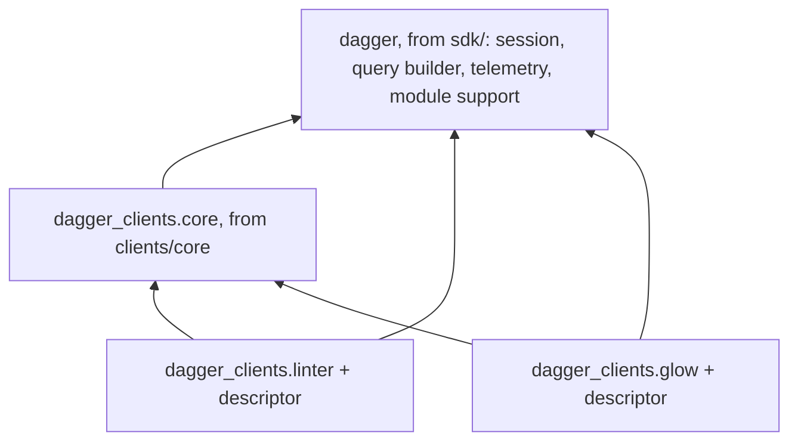
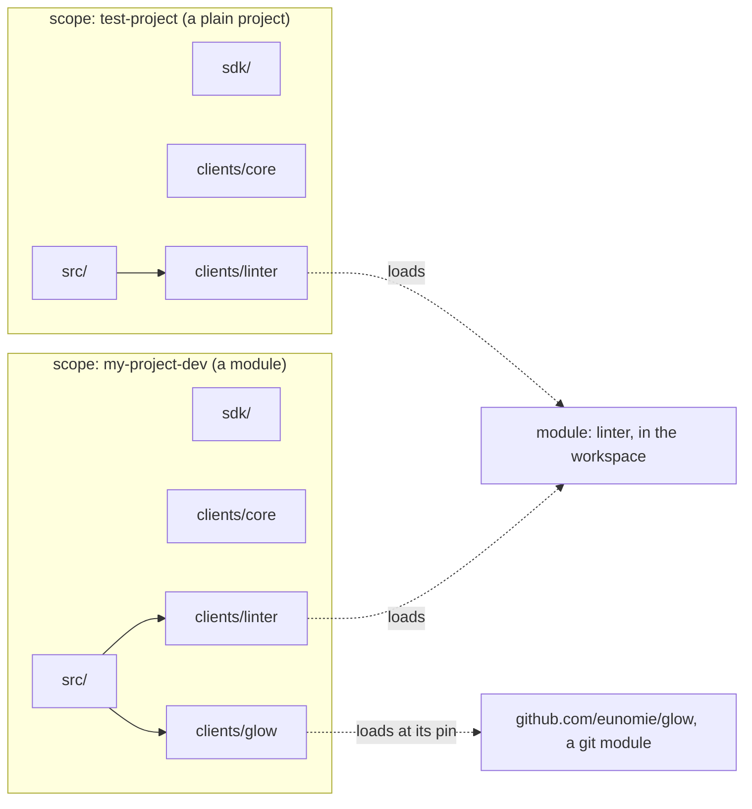

# Unified clients for the Python SDK

Status: design agreed; spikes open (revision 7)
Date: 2026-09-17
Repo base: `7f4b427`
Spec: "Unified clients" (language-neutral). Prior art: `dagger/java-sdk#23`.

This is the markdown copy of the HTML design page. Badges:
**[confident]** checked against code or by experiment.
**[decided]** Yves decided it.
**[provisional]** a detail that follows from a decision; change it freely during
implementation.
**[speculative]** not verified; a phase 1 spike must confirm it.
**[open]** a question for Yves, with a recommendation.

Revision 7, after more discussion:

- One structure, inside a module and outside one: `src/`, `sdk/`,
  `clients/core`, `clients/<name>` (section 4).
- A client is generated **inside the scope that uses it**. No shared location.
  Sharing between scopes may come later (5.1).
- No suggested path for generated clients any more. The scope is the address.
- `dagger.toml` joins a scope to its clients, so generation has an order and a
  repeatable result (5.4).
- After generation, the user's code needs to know nothing about a client but its
  import. The one thing a client needs is the power to load the module it targets.
- Q9 is decided: the SDK writes the client into `[project] dependencies`,
  because the scope is now the consumer.
- The load becomes one engine field, `serveModule`, read in Python as
  `core().serve_module(…)` (section 13).

Earlier revisions. 6: all questions decided. 5: self client; signature rule.
4: no `[[dependencies]]`; shared default session. 3: a scope is one
`pyproject.toml`, a uv workspace root. 2: a temporary global client.

## 1. Summary

- A scope is one `pyproject.toml`. It is a uv workspace root. A module is a
  scope. A test project is a scope.
- Every scope has the same structure: `src/` for the user's code, `sdk/` for the
  SDK files, `clients/core` for the core bindings, and `clients/<name>` for each
  client.
- A client is generated inside the scope that uses it. A module's client sits in
  the module. A test project's client sits in the test project.
- `dagger.toml` records the scope and its clients. `dagger generate` reads that
  to know what to generate, and in which order.
- After generation, the user's code only imports a client. It holds no path, no
  configuration and no client bookkeeping.
- All generated code lives in the namespace package `dagger_clients`. The SDK
  files keep the name `dagger`.
- The way into a client is a function in its own package: `linter()`, `core()`.
  The session argument is optional.
- There is one default session per process. The SDK starts it on the first
  query. All clients share it.
- Each client package carries a descriptor and loads the module it targets on
  first use, with one engine call. No `[[dependencies]]`.
- A module calls itself through a client to itself. The user declares that
  client; the SDK adds none.
- An exported signature may name core types and any of the module's own types,
  the classes of its self client included. The SDK does not check it.
- A temporary global client keeps existing module code working, behind a flag in
  `pyproject.toml`. A new module has no flag.
- The SDK files import generated core in many places today. Phase 1 removes
  these imports.
- Every scope has its own `clients/core`. The copies are identical, because a
  member's files do not depend on its scope.

## 2. Terms

The spec terms apply without change: client, scope, consumer, core, runtime,
serve. Added terms:

| Term | Meaning here |
| --- | --- |
| Scope `pyproject.toml` | The file that defines a scope for this SDK. It is a uv workspace root. It lists the members and their sources. |
| Member | A uv workspace member: a directory with its own `pyproject.toml` inside the scope. `sdk/` and each client are members. |
| Self client | A client to the module that holds it. The module uses it to call its own functions through the engine. |
| Distribution | What a package manager installs, for example `dagger-clients-linter`. |
| Import package | What Python code imports, for example `dagger_clients.linter`. |
| Namespace package | An import package without `__init__.py` (PEP 420). Many distributions can each add one sub-package to it. |
| Client package | The import package inside a client member: `dagger_clients.<name>`. |
| Descriptor | The data that tells a client package where its module is: a workspace path, or a git ref and pin. |
| Default session | The one session per process that a client uses when the caller passes none: `dagger.dag`. |
| Global client | A temporary generated object, `dag`, with one method per core field and per client. It exists only for migration. |

## 3. What exists today [confident]

Checked against `7f4b427`. The SDK generates per scope, and each module gets its
own copy of everything.

- `mod.dang:154` (`vendoredDir`) copies the whole `dagger-io` library into
  `<module>/sdk/`. `mod.dang:280` names that directory.
- `mod.dang:208` (`bindings`) generates one file,
  `sdk/src/dagger/client/gen.py` (`mod.dang:283`). The file holds core and every
  client of the module. The input is the module-facing schema,
  `introspectionSchemaJSON` (`mod.dang:155`).
- The generator emits `class Client(Query)` and `dag = Client()`
  (`sdk/codegen/src/codegen/generator.py:245-257`).
- Module code reaches a client through core: `dag.client_dep()`.
- `python-sdk.dang:164-165` writes each client as `[[dependencies]]`. The engine
  serves the client. Generated code loads nothing.
- `python-sdk.dang:109-114` refuses clients in a scope without a module.
- `findClientRoot` is at `python-sdk.dang:42`, with `pyproject.toml` as the marker.
- A module's `pyproject.toml` names the vendored runtime:
  `dagger-io = { path = "sdk", editable = true }`
  (`templates/default/pyproject.toml.tmpl`). The module build installs it
  (`runtime/build.dang:168`).
- Python SDK settings live in `[tool.dagger]` of the module's `pyproject.toml`:
  `use-uv`, `base-image`. `helpers/pyproject/pyproject.go:60-87` reads and writes
  them. `runtime/build.dang:305` reads them.
- **New since revision 6.** Every generated module names the shared Dang
  entrypoint, `dagger.io/sdk/python/entrypoint@v1` (`python-sdk.dang:78`,
  written at `python-sdk.dang:141-166`). The entrypoint asks the module for its
  types with `python -m dagger.mod describe` (`entrypoint/main.dang:63`), reads
  the JSON (`sdk/src/dagger/mod/_describe.py`, `describe_json`), and replays the
  builder calls in its own session (`entrypoint/main.dang:18-19`). So a module's
  types already travel as data, not as a generated object.
- **New since revision 6.** The static types path is the setting
  `dangEntrypoint` (`python-sdk.dang:32`). It still refuses clients
  (`python-sdk.dang:191`).
- `sdk/src/dagger/__init__.py:12-13` already has a hook for extra generated
  bindings: `from dagger_gen import *`.
- `SharedConnection` (`sdk/src/dagger/client/_session.py:208`) is a process
  singleton. It connects on the first query from `DAGGER_SESSION_PORT` and
  `DAGGER_SESSION_TOKEN`. A module and `dagger run` set these. Without them, a
  plain program must use `async with dagger.connection()`
  (`provisioning/_connection.py:73`).
- The SDK resolves a signature's types in `describe_type`
  (`sdk/src/dagger/mod/_describe.py:137`).
- The engine has an experimental `SELF_CALLS` module feature
  (`ModuleSourceExperimentalFeature`, `sdk/src/dagger/client/gen.py:193`).
- The engine primitives the spec names exist in the committed core bindings:
  `ModuleSource.clientSchemaIntrospectionJSON`, `ModuleSource.withName`,
  `Query.moduleSource(refString, refPin)`, `Module.serve`, `SourceMap.module`.
- The code generator already parses schema directives
  (`sdk/codegen/src/codegen/ast.py:93`). It can read `@sourceMap`.

## 4. One structure [decided]

A module and a plain project get the same tree. The only difference is the
module config file.

```
<scope>/
  pyproject.toml          the scope: a uv workspace root
  src/                    the user's code, the standard Python layout
  sdk/                    the SDK files: session, transport, telemetry, module support
  sdk/src/dagger_global/  the temporary global client, only with the flag (section 9)
  clients/core/           the core bindings
  clients/<name>/         one directory per client
```

```
# a module scope
.../my-module/
  pyproject.toml
  dagger-module.toml      the module config; no [[dependencies]]
  src/my_module/
  sdk/
  clients/core/
  clients/linter/
  clients/my-module/      a self client, only if the user declares one (7.3)

# a test project scope, in the style of Testcontainers
.../test-project/
  pyproject.toml
  src/test_project/
  sdk/
  clients/core/
  clients/linter/
```

- `src/` holds the user's code. Nothing generated goes there.
- `sdk/` holds what is generic: the session, the query transport, telemetry, the
  module support. Nothing in it is tied to the types a module exposes.
- `clients/` holds what is generated from a schema: core, and one client per
  declared client.
- The names `src`, `sdk` and `clients` are the same in every scope, so a reader
  learns the layout once.

The artifact graph [provisional]. An arrow means "imports". The SDK files import
no generated code. Section 9 adds one optional, temporary exception.



The worked example. A module and a test project each use the linter module. Each
scope holds its own client to it. Both clients load the same module.



The two clients to `linter` hold the same bytes, because a client's files do not
depend on the scope that holds it. The copies cost disk, not behaviour. A shared
location would remove the copies; that comes later, if it comes.

## 5. Scopes and generation

### 5.1 A client is generated inside the scope that uses it [decided]

- A client declared on a scope is generated in that scope, in `clients/<name>`.
- A module's clients sit in the module. They travel with it, also in a git
  repository. The module's build sees them, because they are inside its own
  directory.
- A test project's clients sit in the test project.
- A generated client needs no path from the user. The import is the whole of the
  integration.
- A shared location is possible in principle, so that two scopes use one copy.
  It is out of scope for this design.

### 5.2 What a member is [confident]

A directory with `pyproject.toml` and `src/`, built with `uv_build`. It builds
into a wheel without an engine.

```toml
# clients/linter/pyproject.toml (generated)
[project]
name = "dagger-clients-linter"
version = "0.0.0"
dependencies = ["dagger-io", "dagger-clients-core"]

[build-system]
requires = ["uv_build>=0.8.4,<0.12.0"]
build-backend = "uv_build"

[tool.uv.build-backend]
module-name = "dagger_clients.linter"

[tool.dagger]
generated = "client"
```

```
clients/linter/src/dagger_clients/    no __init__.py: a namespace package
  linter/__init__.py                  generated types, linter(), as_linter()
  linter/_target.py                   descriptor and the core digest it was generated against
  linter/py.typed
```

Every generated member has `[tool.dagger] generated`: `"client"`, `"core"` or
`"runtime"`. The SDK uses this marker to find its own members. A member holds no
path and no source entry, so its files do not depend on the scope. One member
generated in two scopes had equal digests.

**The marker is a deletion boundary, so how it is read matters** [confident].
Generation deletes and overwrites only what the marker claims, which makes the
reading of that one key as load-bearing as the rule itself.

- It is read as **TOML**, never as text. A `[` inside a string is not a table
  header. A regex over raw text deleted a user's directory whose description
  happened to quote a marker.
- Only the three kinds above count. Any other value, `"hand-written"` say,
  means a file the SDK does not understand, which is exactly when it must not
  delete or overwrite.
- Each place requires its own kind: `clients/core` must say `core`, a client
  directory must say `client`, `sdk/` must say `runtime`.
- A member the user wrote under `clients/` therefore survives generation, in the
  tree and in the scope file alike.

### 5.3 The scope `pyproject.toml` [decided]

It has three parts, and each part has one owner.

| Part | What it says | Owner |
| --- | --- | --- |
| `[tool.uv.workspace] members` | Which directories are members. | The SDK |
| `[tool.uv.sources]` | Where each client of this scope is. It installs nothing. | The SDK |
| `[project] dependencies` | Which clients this project uses. Only these are installed and importable. | The SDK |

```toml
# <scope>/pyproject.toml
[project]
name = "my-module"
# Core is always a dependency: the module's own code imports dagger_clients.core.
dependencies = ["dagger-io", "dagger-clients-core", "dagger-clients-linter"]

[tool.uv.workspace]
members = ["sdk", "clients/core", "clients/linter", "clients/my-module"]

[tool.uv.sources]
dagger-io                = { workspace = true }
dagger-clients-core      = { workspace = true }
dagger-clients-linter    = { workspace = true }
dagger-clients-my-module = { workspace = true }
```

Tested with uv 0.12.13 [confident]:

- A scope with a `[project]` table can use its own members. With sources for
  three members and a dependency on one, uv installs only that member and core.
- A scope without a `[project]` table also works.
- `uv sync --locked --no-dev` works on that layout. The module build uses that form.
- Removing a member, its source and its directory, then `uv lock`, removes the
  client cleanly.
- Two editable members share the `dagger_clients` namespace. mypy and pyright
  see types across it when each member has `py.typed`.
- A member builds into a wheel with no engine in reach.

### 5.4 What `dagger.toml` gives the SDK [decided]

`dagger.toml` records each scope and the clients of that scope. Because a client
now lives in the scope that declares it, the configuration and the tree say the
same thing.

- What to generate: the client list of a scope is the generation input. Nothing
  is guessed from the tree.
- Order: a client to a local module needs that module's schema. So
  `dagger generate` can order the work: a target module first, then a scope whose
  client points at it. [provisional] The engine drives the scopes, so the order
  is engine-side.
- Repeatable: the same configuration gives the same tree, in the same places.
- Removal: a client that is no longer declared is deleted, with its source and
  its member entry.
- No run-time role: generated code never reads `dagger.toml`. A committed client
  keeps working when the configuration is gone.

## 6. Namespacing [decided]

Generated code goes into the top-level namespace package `dagger_clients`. The
SDK files stay in `dagger`. A client `telemetry` becomes
`dagger_clients.telemetry` and cannot collide with `dagger.telemetry`. A self
client cannot collide with the module's own code: the module is `my_module`, its
self client is `dagger_clients.my_module`. Core is `dagger_clients.core`, so a
client named `core` is refused.

`dagger.clients.<name>` is not possible: `dagger` is a regular package, and type
checkers do not follow `pkgutil.extend_path` across installs.

| Input | Rule | Example |
| --- | --- | --- |
| Client name | Lowercase. Replace `-` and `.` with `_`. | `my-project-dev` → `my_project_dev` |
| Refused | Not an identifier, a keyword, starts with `_`, equal to `core`, two clients with the same result. | `class`, `core` |
| Distribution | `dagger-clients-` + name with `-` | `dagger-clients-my-project-dev` |
| Member directory | `clients/` + name with `-` | `clients/my-project-dev` |
| Root class | Today's codegen rule | `MyProjectDev` |
| Entry function | Snake-case name | `my_project_dev()` |

The SDK writes only into `sdk/` and `clients/`, so a client cannot land on a
user directory. It still refuses to write a member over a directory that exists
without a `[tool.dagger] generated` marker.

## 7. Entry point

### 7.1 The entry function [provisional]

```python
# in a module: src/my_project_dev/__init__.py
from dagger import function, object_type
from dagger_clients.core import Directory
from dagger_clients.linter import linter

@object_type
class MyProjectDev:
    @function
    async def lint(self, src: Directory) -> str:
        return await linter().lint(src)
```

```python
# in a test project: src/test_project/test_lint.py
from dagger_clients.core import core
from dagger_clients.linter import linter

async def test_lint():
    src = core().host().directory(".")
    assert "0 errors" in await linter().lint(src)
```

The two files import the same way. Neither one names a path or a session.

Constructor arguments follow today's rules: required are positional, optional
are keyword-only. The session is an optional keyword-only argument [decided];
without it the function uses the default session (8.1). A GraphQL argument named
`session` becomes `session_`.

```python
def linter(source: Directory, *, config: str | None = None,
           session: Session | None = None) -> Linter: ...
```

### 7.2 Fields a client contributes to core types [decided]

A field a client contributes to a core type becomes a module-level function with
the core receiver first. The receiver holds its session.

```python
from dagger_clients.linter import as_linter

lint = as_linter(binding)          # was: binding.as_linter()
```

Two core types that contribute a field with one name get one function with
`@typing.overload` per receiver type.

### 7.3 A module calling itself [decided]

A module calls one of its own functions through a client to itself. A self
client is a client like any other, and the SDK creates none on its own.

1. The user declares a client to the module on the module scope.
2. `dagger generate` writes `clients/my-module` and its source.
3. The same generation adds `dagger-clients-my-module` to `[project] dependencies`.
4. The module code imports the self client and calls it.

```python
from dagger_clients.my_module import my_module

@object_type
class MyModule:
    @function
    async def build(self) -> str: ...

    @function
    async def release(self) -> str:
        return await my_module().build()     # a call through the engine
```

- Load: the descriptor is the module's own path. In the module's session, the
  client asks the engine for the module at that path and loads it.
  [speculative] The spike checks whether the engine needs the experimental
  `SELF_CALLS` feature for this.
- Order: the self client comes from the module's schema, and the engine reads
  that schema by running the module. So the module runs with the previous self
  client while the SDK generates the next one. Two rules keep this from
  blocking: the dependency comes after the first generation, and a core digest
  mismatch is a warning while the SDK registers types (section 10).
  [speculative] A spike must confirm it.

### 7.4 What an exported signature can name [decided]

A module's exported functions, fields and constructor arguments may name core
types and any of the module's own types. The classes of the module's self
client are the module's own types, so a signature may name them. The SDK does
not check the types a signature names: `describe_type`
(`sdk/src/dagger/mod/_describe.py`) describes a generated class by its name.

## 8. Session and load

### 8.1 The default session [decided]

- The session is not required. A client called without `session=` uses the
  default session, `dagger.dag`.
- There is one default session per process. All clients share it, so objects
  pass between clients.
- The SDK starts the default session on the first query. In a module and under
  `dagger run`, `SharedConnection` already does this today.
- In a plain program, the SDK also provisions the engine on the first query, and
  closes it at exit [confident]. The engine is a `dagger session` subprocess
  that ends when its stdin closes, which is sync, so an `atexit` handler closes
  it after the program's event loop is gone; `dagger.close()` closes it sooner.
  The environment comes first, so a module never provisions. Verified by hand:
  a program that only calls a client exits 0 and leaves no session process.
- **A module says it is one** [confident]. The `sdk/` member carries
  `dagger.provisioning`, because a plain program run inside a module's own scope
  needs it. So both module entrypoints call `mark_module_runtime()` first, and
  after that the default session raises "No active engine session to connect to"
  rather than provisioning. Without it, the only thing keeping a module from
  downloading a CLI into its own container would be the engine always setting
  the session in the environment — an accident, not a rule. The signal is the
  entrypoint, which knows it serves a module, and not an environment variable
  the engine may rename.
- A caller passes `session=` only to use a specific session.

One session per client does not work: an object belongs to one session, and a
module has exactly one session for a function call.

### 8.2 What `dagger.dag` is [confident on shape]

- Without the global client, `dagger.dag` is an instance of a hand-written
  `dagger.Session`. It owns the connection, the query transport and the load
  memo. It has no API fields.
- The new `Session` wraps today's `SharedConnection`. `dagger.connection()` and
  `dagger.Connection` yield a `Session`.
- Without the global client, `dag.container()` does not exist.
  `Session.__getattr__` raises `AttributeError` with a migration message that
  names `core().container()`. The SDK does not import core for the message.
- A module-level `__getattr__` (PEP 562) on `dagger` does the same for
  `dagger.Container` and other core names.

### 8.3 How a client loads its module [provisional]

The load is async, and `linter()` is sync and lazy. So the load runs when a
query executes.

1. The `Context` in the SDK gets the set of descriptors the query needs.
2. `linter()` creates a `Context` that needs the linter descriptor.
3. Chained selections keep the set.
4. `Context.execute` asks the session to load each descriptor first.
5. The session loads each descriptor at most once, with one `anyio.Lock` per entry.
6. An object passed as an argument becomes an ID through its own `execute`,
   which loads its own descriptor.
7. The SDK loads an argument from an ID in `dagger/mod/_converter.py:62`. The
   generated class carries its descriptor for this.

```python
# clients/linter/src/dagger_clients/linter/_target.py (generated)
# Plain data, no import: the descriptor is what generation knew.
NAME = "linter"
REF = "/path/to/the/linter/module"      # from the workspace root, or "github.com/eunomie/glow"
PIN = None                              # or the commit the client was generated against
CORE_DIGEST = "sha256:…"
```

The package's `__init__.py` builds `_TARGET` from those constants. The name is
private: the package's public names are the generated types, and a user of the
client never handles its descriptor.

The SDK owns the `Target` class and the load query. The query uses the raw query
builder, not generated core. One field carries both kinds of reference, so the
descriptor has one shape; see section 13.

### 8.4 The API the generated code targets [decided]

Generated code calls four hand-written names, and nothing else of the SDK:

```python
# dagger.client
@dataclass(frozen=True, slots=True)
class Target:
    name: str
    ref: str
    pin: str | None = None

def client_root(cls: type[T], target: Target | None, field: str | None,
                args: list[Arg], *, session: Session | None = None) -> T
def client_select(receiver: Type, target: Target, field: str,
                  args: list[Arg]) -> Context
def check_core(client: str, expected: str, installed: str) -> None
```

- `client_root` starts a query at the root. `target=None` means there is nothing
  to load, which is how `core()` is emitted, so core and a client share one
  shape.
- `client_select` continues from a core receiver, for a field a client
  contributes to a core type (7.2). It keeps the receiver's session and context.
  It returns a `Context`, so the generated code wraps it in the return type, or
  executes it when the field returns a scalar.
- Both attach the target to the query context. The SDK loads a target at most
  once per session (8.3).
- **The generator passes the exact GraphQL field name.** The SDK never derives
  it from a class name or from `Target.name`: that would copy the engine's
  naming rule into the SDK, where it can drift.
- `check_core` is the import-time staleness check of section 10. Each client
  package calls it with its own name, the digest it was generated against, and
  the digest of the installed core. Core's own package calls nothing.
- The generated packages import `Session`, `Target`, `client_root`,
  `client_select` and `check_core` from `dagger.client`.
- The generator writes no `pyproject.toml`. `generateScope` writes it (12).

## 9. Temporary global client [decided]

Existing module code uses `dag.linter().lint()`, `dag.container()` and
`dagger.Container`. A global client keeps that code working during migration,
without an edit by the user. A new module does not get one.

```toml
# <scope>/pyproject.toml
[tool.dagger]
global-client = true
```

- The flag is in the same table as `use-uv` and `base-image`.
- No flag means no global client. The templates carry no flag.
- `generateScope` writes the flag once, when it upgrades an existing module: the
  module had a config before generation, and has legacy bindings at
  `sdk/src/dagger/client/gen.py`.
- `mod config set --global-client=false` removes the flag. The next
  `dagger generate` removes the global client.
- Only generation reads the flag. The SDK does not read `pyproject.toml` at run time.

Where it goes [confident]. The global client is generic in shape but tied to
one scope's clients, so it belongs with the SDK files: the `sdk/` member gains a
second import package, `sdk/src/dagger_global/`, when the flag is on. Then no
new member appears. The cost: that copy of `dagger-io` depends on the scope's
clients while the flag is on. Clearing the flag must give back exactly the
`sdk/` of a module that never had one.

```python
# sdk/src/dagger_global/__init__.py (generated, temporary)
from dagger import Session
from dagger_clients.core import *                  # dagger.Container keeps working
from dagger_clients.core import core
from dagger_clients.linter import Linter, linter

class Client(Session):
    def container(self, *, platform=None) -> Container:
        return core(session=self).container(platform=platform)

    def linter(self, source: Directory) -> Linter:
        return linter(source, session=self)

dag = Client()
```

- Same classes: `dag.container()` returns `dagger_clients.core.Container`. Old
  and new calls mix in one module.
- Contributed fields: the global client adds `binding.as_linter()` to the core
  class at import, at run time only. Type checkers do not see it, which points
  to the migration.
- Dependencies: the global client is a second import package of the `sdk/`
  member, not a member of its own, so nothing is added to the scope's
  `[project] dependencies`. That member's own `pyproject.toml` gains a
  dependency on core and on each client while the flag is on [confident].
- End of life: a `DeprecationWarning` on import in phase 2. Removal in a later
  release.

The SDK finds it with one optional import, which replaces today's `dagger_gen`
hook (`sdk/src/dagger/__init__.py:12-13`). The import is lazy [confident]:

```python
# dagger/__init__.py (hand-written)
def __getattr__(name):            # PEP 562: on first use, never on import
    if name == "dag":
        return _sessions.default_session()
    ...                           # names of dagger_global, if it is installed
```

An eager `from dagger_global import *` cannot work. The global client imports
core and every client, each of those imports `dagger`, so `dagger` would import
itself whenever a generated package is the first import of the process. A
module-level `__getattr__` runs after `dagger` is built, which breaks the cycle.
`__dir__` and `__all__` follow the same route, so completion and star imports
still see the names.

`dagger.dag` is the default session (8.1). With the flag, the default session
must be the global client's `dag`, so that a client called without `session=`
shares its loads. The SDK gives the global client one seam for this:
`dagger.client._session.set_default_finder(find)`. `dagger/__init__.py` passes a
function that imports `dagger_global` on first use and returns its `dag`, or
`None`. Only the global client uses the seam.

Generation: `codegen generate-global -i <schema> …` writes the package. It takes
the core schema and each client schema, and it fails if their engine versions
differ.

This is the only place the SDK files name generated code. It is off for a new
module, and it goes away with the global client.

An SDK older than this design star-imported its bindings from `dagger_gen`.
Those bindings are no longer loaded. `dagger/__init__.py` finds the module
without importing it (`importlib.util.find_spec`) and warns, so a user who
skipped `dagger generate` is told why `dag` lost its API.

## 10. Type checking and staleness [decided]

| When | Signal | Needs the engine |
| --- | --- | --- |
| Type check | `py.typed` and full annotations. A removed or changed function is a type error after `dagger generate`. | No |
| Import | The client passes its `CORE_DIGEST` and the installed core's digest to an SDK function. A mismatch raises `dagger.StaleClientError` (an `ImportError`) with "run `dagger generate`". While the SDK registers a module's types, it logs a warning instead, so a module with a self client can regenerate (7.3). The SDK receives two strings, so it does not import core. | No |
| Load and query | A failed load raises `dagger.ClientLoadError` with the descriptor and the cause. An engine below the floor, which has no `serveModule`, fails there too: the cause names the field, and it is never a `StaleClientError`, because regenerating cannot give an engine a field it lacks. Once the module is loaded, a validation error naming a missing field, on a query that needs a descriptor, becomes `StaleClientError`. It must be the validator's own error: an internal error that merely quotes the phrase is the engine failing, not a stale client, and telling the user to regenerate would send them the wrong way. An engine/core mismatch is a warning in phase 1. | Yes |

A CI check that runs `dagger generate` and asserts no diff catches the rest.

## 11. Artifact graph rules in Python

| Rule | Python meaning | Check |
| --- | --- | --- |
| Core names no client | `dagger_clients/core/` imports no other `dagger_clients` package. | AST scan; generate core with two client sets and compare digests. |
| No client names another | A client imports only `dagger`, `dagger_clients.core`, itself. | AST scan. |
| The SDK files depend on nothing generated | No `dagger/` module imports `dagger_clients`, `dagger.client.gen`, `dagger_gen`. One exception: the optional `dagger_global` import. | Import every `dagger.*` module in a venv with no generated code; AST scan with the one exception. |

Where the SDK files depend on generated core today [confident].
`dagger/telemetry.py` is clean; the trap is elsewhere:

| Location | Dependency | Fix |
| --- | --- | --- |
| `sdk/src/dagger/__init__.py:10-16` | Star-imports `dagger_gen` or `dagger.client.gen`. | Replace with the optional `dagger_global` import; add PEP 562 message. |
| `sdk/src/dagger/client/_core.py:24`, `client/_session.py:11` | `from dagger import …` runs `dagger/__init__.py`, which loads core. The Python-specific trap. | Import from `dagger._exceptions`, `dagger.telemetry`. |
| `sdk/src/dagger/mod/_module.py`, `_converter.py`, `_exceptions.py`, `_describe.py`, `_entrypoint.py` | Type registration through generated `dag`, `TypeDef`, `TypeDefKind`, `FunctionCachePolicy`, `JSON`. | [decided] Raw query builder. The new `describe` command already emits the types as JSON (`_describe.py`, `describe_json`), which is half of the work. |
| `sdk/src/dagger/provisioning/_connection.py`, `_engine.py` | Imports `dag`, `Client`. | Return a `Session`. |
| `sdk/src/dagger/_engine/_version.py:3` | Generated `CLI_VERSION` in the SDK files, used to download a CLI. | Keep it there; revisit when the SDK files are published. |
| `sdk/codegen/src/codegen/generator.py:245-257` | Emits `Client`, `dag`. | Emit `core()`; emit `Client` and `dag` only into `dagger_global`. |
| `sdk/src/dagger/client/_guards.py:44` | Text names `dagger.client.gen`. | Take the name from the caller. |

## 12. generateScope and findClientRoot

**`generateScope` (`python-sdk.dang:108`) [provisional].** The function keeps its
signature. The scope directory (`ws.cwd`) is the workspace root of the scope.
One path serves a module and a plain project; `isModule` only decides whether a
module config is written.

1. Scope file: read the scope `pyproject.toml`. A scope without one gets a new
   file with the workspace and the sources.
2. SDK files: write `sdk/` with the hand-written SDK only. In an existing
   module, this replaces the vendored `sdk/` and its `gen.py`.
3. Core: generate once from the client-facing schema into `clients/core`. The
   schema is read through an empty stand-in module, because the engine serves a
   client-facing schema to a module, not to nothing. That stand-in is then
   stripped out, or the next step would see it as a client of its own.
4. Clients: for each declared client, read `clientSchemaIntrospectionJSON`,
   partition by `@sourceMap`, write the descriptor (the workspace path, or the
   ref and the pin), write `clients/<name>`. A self client takes the same path.
   Every schema, core's and each client's, is read **in the scope's engine-version
   view** [confident]. The engine serves a module's schema in the view of that
   module's own declared version, and two views give two different cores, which
   the digest check would then refuse. The cost is that a client to an older
   module is read at the scope's version, not at the version that module
   declares.
5. Removed clients: delete each directory under `clients/` that carries
   `[tool.dagger] generated = "client"` and is no longer declared. The scope
   file loses only the entries of members whose **present** directory carries
   the marker. A directory the user removed by hand keeps its entry, because
   generation can no longer prove it owned it; `uv` then names the missing
   member, and the user restores the directory or removes the entry. A visible
   broken scope file is better than a silent edit to a line the SDK may not own.
6. SDK-owned entries: set the `members` entries, one `{ workspace = true }`
   source per member, and one `[project] dependencies` entry per client. Keep
   everything else, including members and dependencies the user added.
   [provisional] This needs a TOML editor that keeps formatting;
   `helpers/pyproject` reformats the file today.
7. Module scope: replace the old `dagger-io = { path = "sdk", editable = true }`
   source with the workspace source; remove every `[[dependencies]]` entry from
   `dagger-module.toml` (the manifest builder already has
   `withoutLegacyRuntimeDependencies`, `python-sdk.dang:164`); handle the global
   client flag.
8. Scope without a module: remove the refusal at `python-sdk.dang:109-114`.
9. Lock: refresh `uv.lock` if it exists.

**Generation must never write a tree the runtime cannot build** [confident].

The module runtime reads `[tool.uv.workspace] members` and `[project]
dependencies` with **`tomllib`, in the SDK's pinned default image**, in one
cached exec per build. Those two are the user's own content, so they can hold
escapes, literal strings and multi-line strings, and only a real parser reads
them correctly. A hand-written reader failed this twice, in opposite
directions: first it read a marker out of a string that only looked like one,
then it refused `"tomli; python_version < \"3.11\""` as "not an array of
strings". **The parser boundary is where the user's content begins.**
Single-line keys that the templates and `mod config set` write — `name`,
`base-image`, `use-uv` — stay on regular expressions, because generation writes
them itself.

The runtime cannot reach the Go helper, which does parse TOML: the shared
entrypoint carries a copy of this build, and there `currentModule` is the
user's module, so it can read none of its own non-Dang files.

What is still refused, and by whom:

- The runtime refuses an array holding anything but strings, rather than
  reading strings out of a structure that is not a list of them.
- The SDK's editor refuses a scope file whose tables it cannot edit while
  keeping the user's formatting, an inline workspace table among them. That
  limit is the editor's, not the runtime's.

Generation compares **both ways**: the members the runtime reads against the
members uv reads from the TOML. A member either one reads and the other does
not stops generation, naming the key and the difference. One way would not be
enough — "the runtime reads at least what I wrote" still lets it read a member
nobody named. This holds for a module scope only; a plain project is never
built by the runtime.

**The module build installs what the project depends on** [confident], and the
members those depend on, in every path: locked uv, unlocked uv and pip. A
workspace member the project does not depend on is the user's business, and
installing it made an unrelated member's requirements break the module.

Each scope writes only inside its own directory, so two scopes never write the
same file.

Two side effects. With no `[[dependencies]]`, the refusal of clients on the
static path (`python-sdk.dang:191`) goes away. And a module's types already
travel as JSON through the shared Dang entrypoint, so the client set no longer
changes how the engine loads a module.

**`findClientRoot` (`python-sdk.dang:42`) [provisional].** The marker stays
`pyproject.toml`. A `pyproject.toml` with `[tool.dagger] generated` belongs to a
generated member, so it is never a client root. The answer is the nearest
`pyproject.toml` above it, which is the scope. Today's `sdk/` lift stays for
modules that are not upgraded yet. This repo's own `sdk/` carries no marker, so
the check in `.dagger/modules/e2e/main.dang` still holds.

## 13. How a client loads its module

A client must load the module it targets, from a client session and from a
module session. The engine field exists and is merged, `dagger/dagger#14210`
at `284cd849`:

```graphql
Query.serveModule(address: String!, refPin: String): Void
```

- A git address resolves through `moduleSource(address, refPin, requireKind: GIT)`.
- A workspace path resolves through `currentWorkspace`, absolute from the
  workspace root and relative from the cwd.
- **A descriptor writes the absolute form, `/.dagger/modules/lib`, never
  `./…`** [confident]. The relative form resolves against the cwd of whoever
  runs the code, so a program started from its own scope directory would load a
  different module, or none. The absolute form names one place in the workspace.
- A bare name is rejected, so a module cannot enumerate what its caller installed.
- Both end in `asModule().serve()`.

**The descriptor keeps one shape**: `ref` is the address, `pin` is `refPin`.
Generated code never branches on which kind of reference it holds.

**The SDK sends `serveModule` for every target** [confident]. A module driven
by a Dang entrypoint runs its Python in an ordinary nested client, which the
engine gives no module context. The engine still knows which module that
process runs for: each client records its parent chain, which the engine sets
and the process cannot. From a process under a module, `serveModule` resolves
a local path in the nearest such module's own tree: its git repository at the
pinned commit, the directory it was built from, or on the host its git
repository, or its own directory outside one. It refuses a path that leaves
the tree and a target with no module config, and never reads the caller's
workspace. A plain program keeps resolving in its own workspace.

Nothing is handed to the module's code, so no capability to the caller's
files reaches it. An engine without this rule, such as the beta.14 floor,
resolves a module's local client in the caller's workspace, and can serve the
wrong module.

**How far the evidence reaches** [confident]. A check runs module code that
walks every identifier it holds, whatever the loader keeps and its own current
workspace, and every route that could rebuild a directory from outside the
module's files, at climb depths 1 to 12, one level of recursion, under both
entrypoint forms, and reads nothing. It
distinguishes a refused capability from a field the engine does not have, and
asserts the second count is zero, so a route cannot pass by naming a field that
does not exist. What it does not cover: a field a later engine adds, a third
hop, and a route needing more than one level of recursion. The probe reads the
caller's file against the shape that leaked, so it can fail.

**This protects a module that runs on this SDK's entrypoint, and nothing more.**
The engine hands every Dang entrypoint the caller's workspace, so a module that
brings its own entrypoint reads the caller's files whatever an SDK does. That is
the engine's to fix.

**What the field still owes the caller's cache** [open]. A load at run time is
invisible to the cache key of the call that performed it. So a caller keeps its
cached result after its client's target changes, which `[[dependencies]]` used
to prevent. Every SDK that drops `[[dependencies]]` inherits this, so the answer
belongs to the field, not to a language.

### `core.serveModule`, not `dag.serveModule` [provisional]

Both names describe one field of `Query`, so the engine schema is the same. The
difference is what an SDK shows the user.

- In this design `dag` is the session. It owns the connection and holds no API
  field (property 2). A field named on `dag` would put an API call back on the
  session.
- Core binds `Query`, so the field arrives as `core().serve_module(…)` with no
  work on our side. That is also how a user would reach it by hand, for a module
  the SDK did not generate a client for.
- Neither choice changes the SDK files: the load query goes out through the raw
  query builder, so the SDK never imports core to send it.

So: yes to `serveModule`, and please put it on `Query`. Python will read it as core.

### What this SDK needs from the field

| Need | Why |
| --- | --- |
| One argument for both kinds of reference: a workspace path and a git URL. | The SDK gets one code path and one descriptor shape. Today it needs two: `moduleSource(refString, refPin)` for git, and a path field for local. |
| A path resolves in the caller's own context. | This is the property that makes one client work in a module and in a plain program (`dagger/dagger#14148`). A module resolves against its own context root, a client session against its workspace. |
| A pin for a git reference. | The client records the commit it was generated against, and loads that commit. |
| Idempotent. | The SDK loads once per session and per client, but a second call must not fail. |
| The same call in both session kinds. | One code path in the SDK, for a module and for a plain program. |
| One round trip. | It replaces the chain `moduleSource` → `withName` → `asModule` → `serve`. A first use costs one query. |

With that field, the descriptor holds one reference and an optional pin (8.3),
and the SDK has one load path for every client.

**No name is pinned, and none is needed.** An earlier revision asked the field
for a `name:` argument, so that a client could state the name its bindings were
generated under. That was wrong: nobody chooses that name. `dagger module client
add` cannot set one, `asModule().serve()` has none, and the engine derives it
from the module's own config, by the same code, both when the SDK generates
against that module's schema and when `serveModule` resolves the same address.
The two agree unless the module renamed itself, and that client is stale by
definition. The first selection then fails with "cannot query field", which the
SDK turns into `StaleClientError` telling the user to run `dagger generate`
(section 10). The cost of not pinning: if the engine ever changes how it derives
a name, every client regenerates rather than keeping the old name.

- The design does not use `[[dependencies]]`, and it does not use
  `currentWorkspace` from module code.
- The floor is released `v1.0.0-beta.14`, which has the field and drives Dang
  entrypoints. The SDK's load path for engines without `serveModule` is gone, so
  an older engine fails the load with `ClientLoadError` naming the missing
  field — never with advice to regenerate, which could not help.
- `entrypointClientCallCheck` runs a module through each entrypoint form,
  calling a local client. Nothing did that before, which is why the entrypoint
  defect above reached a user rather than a check.
- A path in a descriptor is written against the workspace root, absolute
  [confident]. A module session resolves it against the same workspace, and
  `/../tmp` is normalised back inside it rather than escaping. Symlinks are not
  verified.
- [speculative] A module can load itself (7.3).

## 14. Decisions

| Question | Decision |
| --- | --- |
| Q1. Namespace name | `dagger_clients`. |
| Q2. Where the SDK files come from | A copy in each scope: `sdk/`, with no generated code. Published later, which removes the copy. |
| Q3. The session | An optional keyword-only `session=`. One default session per process, started on the first query and shared by every client. In a plain program, the SDK provisions the engine on the first query. |
| Q4. Contributed field shape | Module-level function: `as_linter(binding)`. |
| Q5. The global client | Flag `[tool.dagger] global-client = true`. Contributed fields are added to the core class at run time. A `DeprecationWarning` in phase 2; removal in a later release. It sits with the SDK files (section 9). |
| Q6. Module support and core | Rewrite the module support protocol on the raw query builder. |
| Q7. How a local client loads its module | Through an engine field that resolves a path in the caller's own context: `serveModule` (section 13). No `[[dependencies]]`. |
| Q8. Clients outside the scope | [closed] A client is generated inside the scope that uses it, so the case does not exist. Sharing between scopes may come later. |
| Q9. Who writes `[project] dependencies` | The SDK. A client declared on a scope is a client that scope uses, so generation writes the dependency, and removes it with the client. The user's code then works right after `dagger generate`. |
| Q10. Removing a client | `generateScope` deletes the member, its source and its `members` entry, then relocks. |
| Q11. Version check strictness | Client/core mismatch: import error, and a warning while the SDK registers types. Engine/core mismatch: warning in phase 1. |
| Q12. The tree inside a scope | `src/`, `sdk/`, `clients/core`, `clients/<name>`. The same inside a module and outside one. No suggested workspace location. |
| Q13. Client types in a module's own signatures | An exported signature may name core types and any of the module's own types, the classes of its self client included. The SDK does not check it (7.4). |
| Q14. A self client for every module | No. The user declares a client to the module when the module calls itself. |

## 15. Checks

Invert each assertion once and confirm that it fails.

1. One structure: a generated module and a generated plain project have the same tree.
2. One artifact: the digest of `clients/linter` is the same in a module scope and in a plain project scope.
3. SDK isolation: import every `dagger.*` module in a venv with no generated code.
4. Graph rules: an AST scan of imports in core, in each client package and in the SDK files.
5. Call shape: module source that calls a client passes mypy and pyright, then `dagger call` runs it.
6. Standalone build: `uv build --wheel` for each member with no engine; the wheel exists and imports in a fresh venv.
7. Staleness: a changed `CORE_DIGEST` raises `StaleClientError`; during type registration it logs a warning.
8. Load memo: two calls on one client send one load; two sessions send two.
9. Shared session: `linter().lint(core().directory())` works.
10. End to end, module: a module with a git client and a local client loads both through the CLI.
11. End to end, plain project: a test project with a client runs its test with no engine handling of its own.
12. No `[[dependencies]]`: generating a module that has them removes them; the module still calls its clients.
13. Configuration drives generation: adding a client writes exactly one member, one source, one `members` entry and one dependency; removing it undoes all four.
14. Import after generate: a scope with a fresh client imports it with no edit by the user.
15. Name pinning: none. A client whose generated name differs from the name the engine serves fails on its first selection, and that becomes `StaleClientError` naming the client, its address and the remedy (13).
16. Generated code needs no configuration: delete the client entries from `dagger.toml`, keep the tree, and the module still calls its clients.
17. Global client, existing module: the flag is written; the unchanged source passes mypy and runs through `dagger call`; `type(dag.container()) is dagger_clients.core.Container`.
18. Global client, new module: no flag, no `dagger_global`; `dag.container` raises the migration message.
19. Global client, turned off: the global client and its dependency are gone.
20. Install one: a consumer that names one client gets only that client, core and the SDK files.
21. Remove a client: its member, source and `members` entry are gone; `uv sync --locked` passes.
22. User content kept: user tables, comments and a user member survive generation byte for byte.
23. Default session in a plain program: a program with no connection handling runs a client call and exits cleanly. **Passes**: exit 0, no session process left, 23.7s cold and 1.9s warm.
24. Self client: a module with a client to itself calls its own function through `dagger call`; after an API change, generation succeeds.
25. Signatures: a function that returns a core type, the module's own class or a class of its self client registers.

## 16. Phases

**Phase 1: clients that load their own module, in every scope.**

- Spikes first: a module loads itself, with and without `SELF_CALLS`, and
  regenerates with a self client; core-alone schema; a workspace scope in the
  module build (uv and pip modes); a format-keeping TOML editor; where the global
  client lives; typing through `dagger_global`; the default session in a plain
  program.
- Remove every import of generated core from the SDK files.
- SDK files: `Session` and the default session, `Target`, the load memo, the
  core digest check, error types.
- Generator: partition by `@sourceMap`; core and one member per client; entry
  functions; descriptors; digests; the global client with the flag.
- `generateScope` writes the one structure in every scope, manages the members
  and the sources, and removes `[[dependencies]]`. It generates for a scope
  without a module too.
- `findClientRoot` lifts a member to its scope. `mod config` handles the flag.
- Checks 1–25. Local-client checks run once the engine has the field.

**Phase 2: published SDK files, end of migration.** Publish the SDK files and
remove the `sdk/` copy from a scope. The global client warns on import; its
removal date is Yves's call.

## 17. Not verified

- [speculative] A module can load itself into its own session, and whether that
  needs `SELF_CALLS`.
- [speculative] Regeneration of a module with a self client does not block.
- [speculative] The module build installs a scope that is a uv workspace root,
  in uv and pip modes. The locked uv path is proved; the pip and unlocked paths
  install every member, which is a defect being fixed.
- [speculative] A symlinked path in a descriptor.
- [speculative] A scope inside a tree that already has a uv workspace root above it.
- [speculative] The global client as a second import package of the `sdk/`
  member, and whether mypy and pyright then type `dagger.dag` as the global
  `Client`.
- **[blocker, not ours to fix] A changed client target returns a cached result.**
  `[[dependencies]]` used to put the target module into the caller's identity, so
  changing the target changed the caller's digest. A unified client records a
  path and loads the module at run time, so nothing about the target reaches the
  caller's cache key. Proved on the `284cd849` engine: call a local client,
  change only the target's implementation, call the unchanged caller again, get
  the old result. This is a question for the engine and the specification — what
  `serveModule` contributes to the cache key of the call that used it. No SDK can
  fix it from outside.
- [speculative] `Module.serve` from a module session on the engine this repo targets.
- [speculative] Spec decision 4: a client function whose signature names a type
  from another client.

Verified by experiment with uv 0.12.13, on hand-written stand-ins for generated
members: namespace build; shared namespace across editable installs; mypy and
pyright errors across the namespace; a scope root with and without `[project]`;
a scope that installs only the client it names, plus core;
`uv sync --locked --no-dev`; removal and relock; one member's files are identical
in two scopes.

Verified while building it, against a live engine:

- The engine's introspection JSON carries `@sourceMap(module:)`, and a partition
  on that directive splits core from the module-owned types. **One gap** [known
  limitation]: in an engine view before v1.0.0, a module's own `XID` scalar and
  its `loadXFromID` field carry no `@sourceMap`, so the partition counts them as
  core. Core then differs from the core the scope generated, and the client is
  refused as skew. A client in a scope older than v1.0.0 cannot be generated
  until the partition treats those two shapes as module-owned.
- Core alone: read the client-facing schema through an empty stand-in module,
  then strip that module out of the schema. Core comes out byte for byte the
  same as without the stand-in.
- The whole path works with the released CLI on a released engine, outside the
  check harness (`hack/try-unified-clients.sh`): `dagger module init python`
  twice, `dagger module client add ../lib`, then a module calling
  `lib().greeting()` through `dagger_clients.lib`, and `core()` beside it.
- A plain program, in a scope with no `[project]` table, calls a client through
  `dagger.connection()`. The engine is provisioned, the module is loaded, and
  the call returns.
- **The SDK that generates a module must be the one that runs it.** A generated
  manifest now names only a Dang entrypoint, so the danger is no longer the
  builtin runtime but a *published* entrypoint older than the layout it is asked
  to run: it refuses the module for want of `sdk/src/dagger/client/gen.py`. A
  checkout under development therefore needs its own entrypoint reachable, and
  an entrypoint source may name only a git ref or a path inside the module.
- Core's digest does not depend on which clients are generated beside it. The
  digest comes from the client-facing schema. The module-facing schema gives a
  different digest, so generation must always read the same view.
- The global client cannot be imported eagerly from `dagger/__init__.py`. Every
  generated package imports `dagger`, so the eager import is a cycle. A
  module-level `__getattr__` (PEP 562) removes it.
- An engine reports an unknown field with a GraphQL validation error, with no
  path and with `extensions.code == "GRAPHQL_VALIDATION_FAILED"`. Checked on
  beta.11 and beta.13. Only that exact signal marks a stale client (section 10).
  It no longer decides how a client loads: the floor is beta.14, which has
  `serveModule`, and the load path for engines without it is gone.
- A module driven by a Dang entrypoint runs its Python as an ordinary nested
  client. The engine attaches module context only to execs it starts itself, so
  that process reports `currentWorkspace` from its own container and no
  `currentModule` at all. `serveModule` finds the module through the
  process's parent chain instead.
